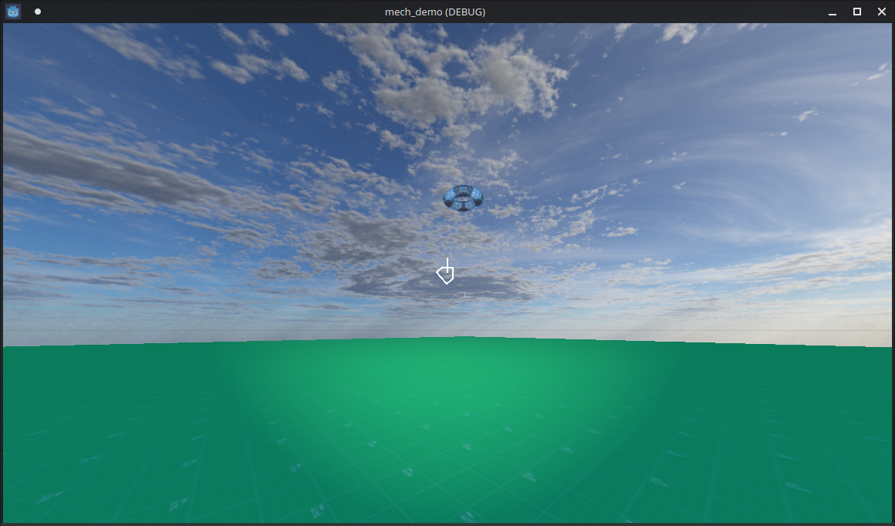

# Mech Character Controller Demo
Mech character controller demo for the Godot Game Engine

This is a demonstration of how to implement a Mech character controller with networking on the Godot Game Engine.

You can look around like in a first-person shooter independent of character's heading

Also includes a skybox and infinite plane.

Video: 

https://github.com/8bitprodigy/mech_demo/assets/6080682/bfb4f0b3-e46a-4722-9ff0-6650a9055791
